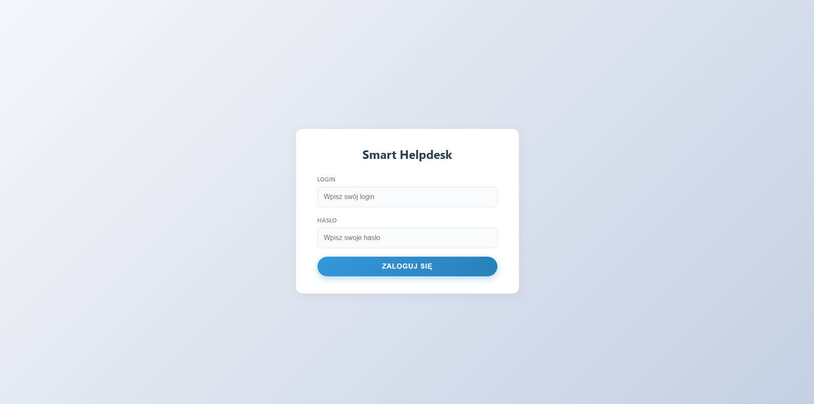
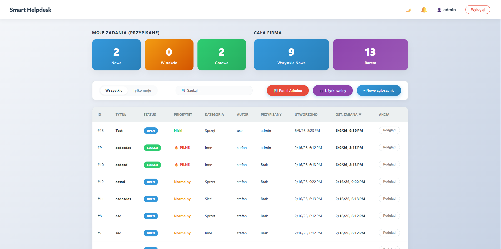
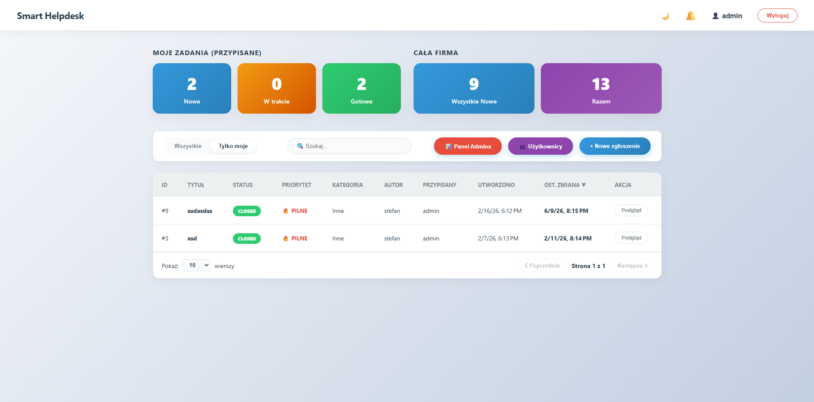
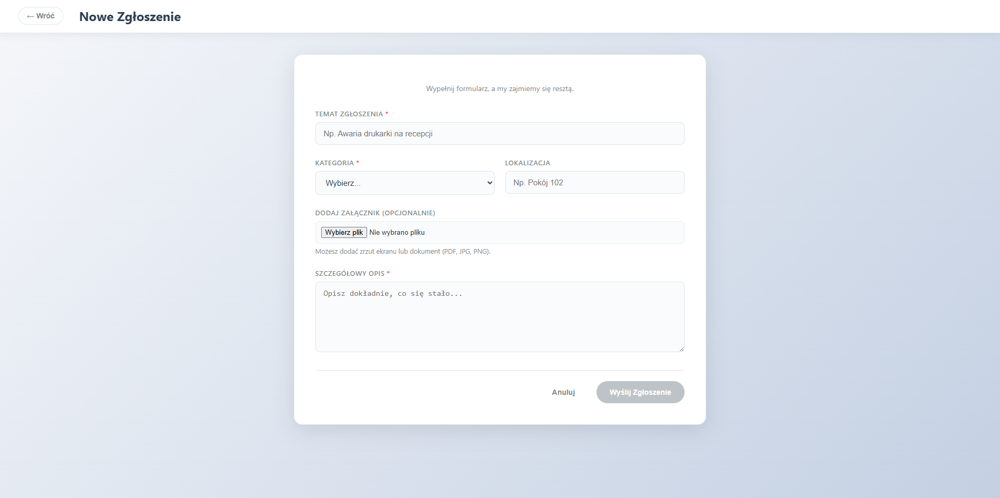
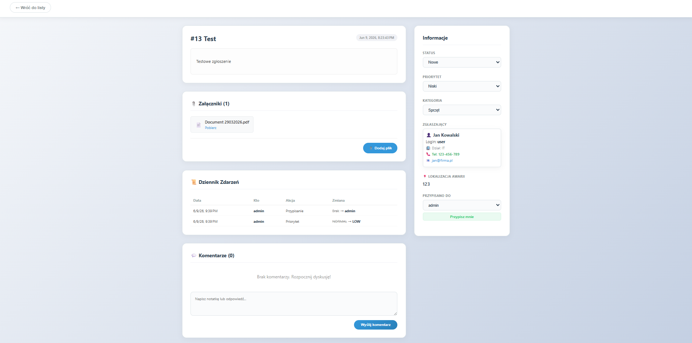
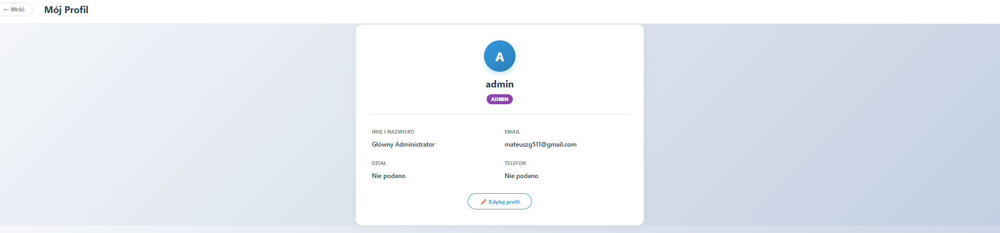
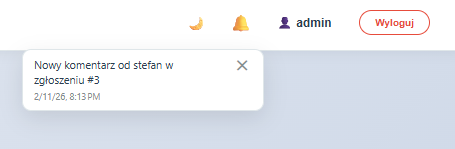
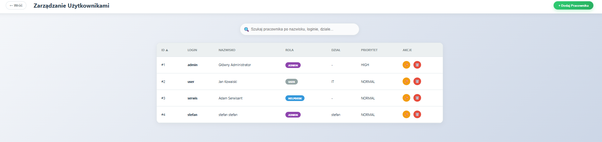
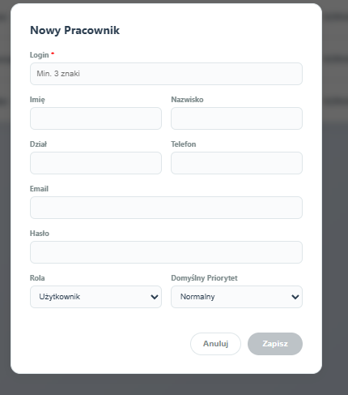

# 🎫 Smart Helpdesk System

> Zaawansowana platforma do zarządzania zgłoszeniami serwisowymi (ticketing system) klasy Enterprise — zbudowana w oparciu o Spring Boot 3.2 i Angular 17.

---

## 📋 Spis treści

- [Opis projektu](#opis-projektu)
- [Zrzuty ekranu](#zrzuty-ekranu)
- [Funkcjonalności](#funkcjonalności)
- [Architektura techniczna](#architektura-techniczna)
- [Wymagania środowiskowe](#wymagania-środowiskowe)
- [Instrukcja uruchomienia](#instrukcja-uruchomienia)
- [Role i uprawnienia](#role-i-uprawnienia)
- [Stos technologiczny](#stos-technologiczny)

---

## 📌 Opis projektu

**Smart Helpdesk System** to kompletna aplikacja full-stack przeznaczona do obsługi zgłoszeń serwisowych w firmach i działach IT. System obsługuje pełny cykl życia ticketu — od momentu jego rejestracji, przez przypisanie, diagnostykę i komunikację, aż po finalne zamknięcie. Aplikacja wspiera wiele ról użytkowników z odpowiednio rozdzielonymi uprawnieniami oraz zapewnia automatyczne powiadomienia e-mail przy każdej zmianie statusu.

---

## 📸 Zrzuty ekranu

### 🔐 Logowanie
> Ekran logowania z autoryzacją JWT. Użytkownik wpisuje login i hasło — po uwierzytelnieniu otrzymuje token i zostaje przekierowany do dashboardu.



---

### 📊 Dashboard — widok wszystkich zgłoszeń
> Główny panel aplikacji. Wyświetla kafelki ze statystykami (Moje zadania przypisane oraz stan całej firmy), pełną listę zgłoszeń z kolumnami: ID, tytuł, status, priorytet, kategoria, autor, przypisany, daty. Dostępne przyciski: Panel Admina, Użytkownicy, Nowe zgłoszenie.



---

### 🔍 Filtrowanie — tylko moje zgłoszenia
> Widok po przełączeniu filtra na „Tylko moje" — lista zawęża się wyłącznie do zgłoszeń przypisanych do zalogowanego użytkownika. Widoczna paginacja z wyborem liczby wierszy na stronę.



---

### ➕ Tworzenie nowego zgłoszenia
> Formularz rejestracji nowej awarii. Pola: temat zgłoszenia, kategoria (dropdown), lokalizacja, załącznik (PDF/JPG/PNG) oraz szczegółowy opis. Przycisk „Wyślij Zgłoszenie" aktywuje się po uzupełnieniu wymaganych pól.



---

### 🎫 Szczegóły zgłoszenia
> Widok pojedynczego ticketu. Po lewej: opis zgłoszenia, sekcja załączników z możliwością pobrania i dodania pliku, Dziennik Zdarzeń (Audit Trail) z historią zmian oraz sekcja komentarzy. Po prawej: panel zarządzania — zmiana statusu, priorytetu, kategorii, przypisanie serwisanta i dane zgłaszającego.



---

### 👤 Profil użytkownika
> Strona profilu z danymi konta: imię i nazwisko, email, dział, telefon oraz oznaczenie roli (ADMIN/HELPDESK/USER). Dostępny przycisk edycji profilu.



---

### 🔔 Powiadomienia real-time
> Powiadomienie w interfejsie użytkownika wyświetlane po dodaniu nowego komentarza przez innego użytkownika. Ikona dzwonka w nawigacji wskazuje liczbę nieprzeczytanych powiadomień.



---

### 👥 Zarządzanie użytkownikami (Admin)
> Panel administracyjny zarządzania kontami. Lista pracowników z kolumnami: ID, login, nazwisko, rola (kolorowe oznaczenia ADMIN/HELPDESK/USER), dział, domyślny priorytet oraz przyciski akcji (edytuj, usuń). Wyszukiwarka po nazwisku, loginie lub dziale.



---

### ➕ Dodawanie nowego pracownika
> Modal tworzenia nowego konta. Pola: login, imię, nazwisko, dział, telefon, email, hasło, rola (Użytkownik/Helpdesk/Admin) oraz domyślny priorytet zgłoszeń przypisywanych temu pracownikowi.



---

## ✨ Funkcjonalności

### 🎫 Zarządzanie zgłoszeniami (Ticketing)

- **Tworzenie zgłoszeń** — użytkownicy rejestrują problemy, podając temat, kategorię i lokalizację
- **Kategorie zgłoszeń** — podział na kategorie (np. sprzęt, sieć, oprogramowanie) ułatwiający routing
- **Zmiana statusu** — administrator/helpdesk może zmieniać status zgłoszenia (np. Nowe → W trakcie → Rozwiązane → Zamknięte)
- **Priorytetyzacja** — przypisywanie priorytetu: `Low`, `Normal`, `High`
- **Sortowanie kolejki** — dynamiczne zarządzanie kolejką zgłoszeń na podstawie priorytetu i daty
- **Obsługa załączników** — możliwość dodawania plików do zgłoszenia (logi, zrzuty ekranu)
- **Historia zmian (Audit Trail)** — każde zgłoszenie przechowuje pełną historię: kto, kiedy i co zmienił
- **Wyszukiwanie i filtrowanie** — przeglądanie zgłoszeń według statusu, kategorii, priorytetu lub przypisanego serwisanta

### 💬 System komentarzy

- **Komentarze wewnętrzne** — komunikacja między użytkownikiem a zespołem helpdesk bezpośrednio w zgłoszeniu
- **Historia wątku** — pełna historia rozmowy zachowana przy każdym tickecie
- **Powiadomienia o nowych komentarzach** — real-time informacja dla zaangażowanych stron

### 👥 Role i zarządzanie użytkownikami (RBAC)

- **Rejestracja i logowanie** — z pełną obsługą JWT (bezstanowa autoryzacja)
- **Trzy role systemowe:**
  - `USER` — tworzenie zgłoszeń, śledzenie statusów własnych ticketów, dodawanie komentarzy
  - `HELPDESK` — zarządzanie kolejką, przypisywanie zadań do serwisantów, zmiana statusów, diagnostyka
  - `ADMIN` — pełna administracja: zarządzanie kontami, konfiguracja kategorii, podgląd statystyk
- **Przypisywanie zgłoszeń** — admin/helpdesk może przypisać ticket do konkretnego serwisanta
- **Zarządzanie kontami** — admin tworzy, edytuje i dezaktywuje konta użytkowników

### 📧 Powiadomienia i automatyzacja

- **Automatyczne e-maile SMTP** — system wysyła wiadomości przy zmianach statusów zgłoszeń
- **Powiadomienia real-time w UI** — użytkownik widzi powiadomienia bez przeładowania strony
- **Audit Trail** — automatyczna rejestracja każdej zmiany w zgłoszeniu (kto, kiedy, co)

### 📊 Dashboard analityczny (Admin)

- **Statystyki wydajności** — podgląd kluczowych wskaźników działu wsparcia
- **Podział zgłoszeń według kategorii** — wizualizacja rozkładu typów problemów
- **Skuteczność serwisantów** — analiza liczby rozwiązanych ticketów per osoba
- **Widok wszystkich zgłoszeń** — pełna lista z możliwością filtrowania i sortowania

### 🔐 Bezpieczeństwo

- **JWT Authentication** — bezstanowe tokeny autoryzacyjne w każdym żądaniu API
- **Spring Security** — ochrona endpointów na poziomie backendu
- **HTTP Interceptors** — automatyczne dołączanie tokenów do każdego żądania po stronie frontendu
- **Separacja uprawnień** — każda rola ma dostęp wyłącznie do swoich zasobów

---

## 🏗️ Architektura techniczna

Aplikacja oparta na architekturze **SPA (Single Page Application)** z pełnym rozdzieleniem backendu i frontendu.

```
┌─────────────────┐        REST API / JWT        ┌──────────────────────┐
│  Angular 17 SPA │  ◄──────────────────────────► │  Spring Boot 3.2 API │
│   (port 4200)   │                               │     (port 8080)      │
└─────────────────┘                               └──────────┬───────────┘
                                                             │
                                                   ┌─────────▼─────────┐
                                                   │    PostgreSQL DB   │
                                                   └───────────────────┘
```

### Backend (Java / Spring Boot)

- **Architektura warstwowa:** Controllers → Services → Repositories → DTOs
- **Bezpieczeństwo:** Spring Security + JWT (stateless)
- **ORM:** Spring Data JPA / Hibernate → PostgreSQL
- **E-mail:** Spring Mail (SMTP)
- **Build:** Maven

### Frontend (TypeScript / Angular)

- **Framework:** Angular 17 (Standalone Components)
- **Komunikacja HTTP:** RxJS Observables + HTTP Interceptors (JWT headers)
- **Stylizacja:** SCSS / CSS
- **Build:** Angular CLI (`ng serve`, `ng build`)

---

## ⚙️ Wymagania środowiskowe

| Wymaganie | Wersja minimalna |
|-----------|-----------------|
| JDK | 17+ |
| Node.js | 18+ |
| npm | dowolna (bundled z Node) |
| PostgreSQL | 13+ |
| Maven | 3.8+ |

---

## 🚀 Instrukcja uruchomienia

### Opcja 1 — Ręczne uruchomienie

**1. Baza danych**
Upewnij się, że PostgreSQL działa i skonfiguruj połączenie w `src/main/resources/application.properties`.

**2. Backend**
```bash
# W głównym katalogu projektu
./mvnw spring-boot:run
```

**3. Frontend**
```bash
cd frontend
npm install
ng serve
```

**4. Dostęp**
Aplikacja dostępna pod adresem: `http://localhost:4200`

Domyślne dane administratora:
```
Login: admin
Hasło: admin123
```

### Opcja 2 — Docker Compose

```bash
docker-compose up --build
```

### Opcja 3 — Skrypt Windows

```bash
run_app.bat
```

---

## 👤 Role i uprawnienia

| Funkcja | USER | HELPDESK | ADMIN |
|---------|:----:|:--------:|:-----:|
| Tworzenie zgłoszeń | ✅ | ✅ | ✅ |
| Podgląd własnych zgłoszeń | ✅ | ✅ | ✅ |
| Dodawanie komentarzy | ✅ | ✅ | ✅ |
| Dodawanie załączników | ✅ | ✅ | ✅ |
| Zmiana statusu zgłoszenia | ❌ | ✅ | ✅ |
| Przypisywanie serwisanta | ❌ | ✅ | ✅ |
| Ustawianie priorytetu | ❌ | ✅ | ✅ |
| Podgląd wszystkich zgłoszeń | ❌ | ✅ | ✅ |
| Zarządzanie kategoriami | ❌ | ❌ | ✅ |
| Zarządzanie użytkownikami | ❌ | ❌ | ✅ |
| Dashboard analityczny | ❌ | ❌ | ✅ |

---

## 🛠️ Stos technologiczny

| Warstwa | Technologia |
|---------|-------------|
| Backend | Java 17, Spring Boot 3.2, Spring Security, Spring Data JPA |
| Baza danych | PostgreSQL, Hibernate |
| Autoryzacja | JWT (JSON Web Tokens) |
| Frontend | Angular 17, TypeScript, RxJS |
| Stylizacja | SCSS, CSS |
| Build (backend) | Maven |
| Build (frontend) | Angular CLI |
| Konteneryzacja | Docker, Docker Compose |
| Powiadomienia e-mail | Spring Mail (SMTP) |

---

## 📁 Struktura projektu

```
smart-helpdesk/
├── src/                        # Kod źródłowy backendu (Spring Boot)
│   └── main/java/.../
│       ├── controller/         # Kontrolery REST API
│       ├── service/            # Logika biznesowa
│       ├── repository/         # Warstwa dostępu do danych (JPA)
│       ├── model/              # Encje bazodanowe
│       └── dto/                # Data Transfer Objects
├── frontend/                   # Aplikacja Angular 17
│   └── src/app/
│       ├── components/         # Komponenty UI
│       ├── services/           # Serwisy HTTP
│       └── guards/             # Ochrona tras (JWT)
├── IMG/                        # Zrzuty ekranu aplikacji
├── Dockerfile                  # Konfiguracja Dockera
├── docker-compose.yml          # Docker Compose
└── pom.xml                     # Zależności Maven
```

---

*Smart Helpdesk System — zarządzanie zgłoszeniami serwisowymi dla nowoczesnych firm IT.*
